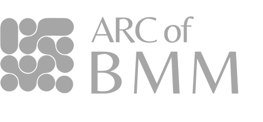

<h1 align="center">Project IMACE · Charter Documentation</h1>

  <em>Integrated Modular Architecture for Cognitive Emulation</em>

  

  
  
  

  This repository contains the governance, research, policy, and affiliation documents that define the operational framework of
  <a href="https://imace.online">Project IMACE</a>.

---

## Overview

Project IMACE is an open research initiative focused on cognitively grounded artificial systems, modular architecture, and interpretable cognitive emulation.

This repository serves as the authoritative documentation layer for the project’s structure, scope, policies, and affiliations.

---

## Document Index

| Document | Purpose |
|---|---|
| [Charter](CHARTER.md) | Core identity, purpose, and authority |
| [Structure](STRUCTURE.md) | Roles, coordination, and decision flow |
| [Research Scope](RESEARCH_SCOPE.md) | Research direction, boundaries, and philosophy |
| [Affiliation](AFFILIATIONS.md) | External and cross-ARC affiliations |
| [Collaboration](COLLABORATION.md) | Participation and collaboration model |
| [IP Policy](IP_POLICY.md) | Attribution, origin, and identity protection |
| [Licensing](LICENSING.md) | Repository-level licensing policy |
| [Sponsorship](SPONSORSHIP.md) | Support, sponsorship, and resource contributions |

---

## At a Glance

| Field | Details |
|---|---|
| **Project** | Project IMACE |
| **Full Form** | Integrated Modular Architecture for Cognitive Emulation |
| **Nature** | Independent open research initiative |
| **Orientation** | Cognitive emulation, modularity, interpretability |
| **Ecosystem** | THE ALTERN Research / cross-ARC program |

---

## Research Themes

- Cognitive emulation
- Modular cognitive architecture
- Interpretability and alignment
- Human–machine interaction
- Open research infrastructure
- Empirical evaluation of cognition-inspired systems

---

## Visual Framework

  

  

  

  

  

---
## Explore Policies & Support

  
  &nbsp;&nbsp;&nbsp;
  

---

## How to Use This Repository

Use this repository to understand:

- what Project IMACE is
- how it is structured
- how it governs research and collaboration
- how affiliations and sponsorships are handled
- how licensing and attribution are managed

For implementation work, refer to the individual project repositories under the IMACE ecosystem.

---

## Closing Statement

Project IMACE is a structured attempt to build an open research framework for cognitive emulation that remains interpretable, modular, and scientifically grounded.

---

 

  A Cross-ARC Research Program of 
  

  supported by 
  

  © Project IMACE · Open Research Initiative

